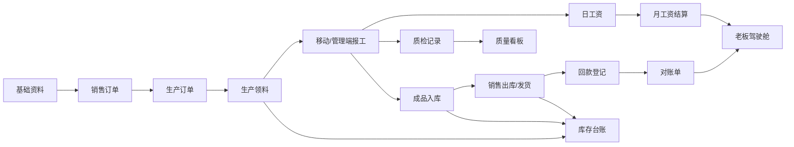
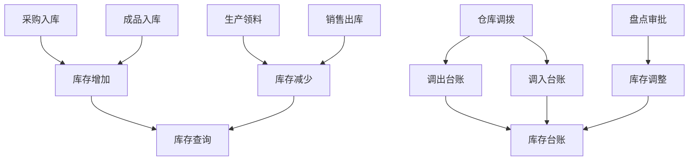
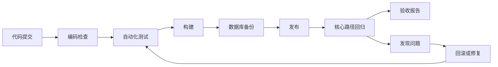

# 业务流程图

使用 Skill：requirements-doc、project-plan

## 1. 主业务闭环

```mermaid
flowchart LR
  A["基础资料"] --> B["销售订单"]
  B --> C["生产订单"]
  C --> D["生产领料"]
  D --> E["移动/管理端报工"]
  E --> F["质检记录"]
  E --> G["成品入库"]
  G --> H["销售出库/发货"]
  H --> I["回款登记"]
  I --> J["对账单"]
  E --> K["日工资"]
  K --> L["月工资结算"]
  D --> M["库存台账"]
  G --> M
  H --> M
  J --> N["老板驾驶舱"]
  L --> N
  F --> O["质量看板"]
```

## 2. 仓储闭环

```mermaid
flowchart TD
  A["采购入库"] --> B["库存增加"]
  C["生产领料"] --> D["库存减少"]
  E["成品入库"] --> B
  F["销售出库"] --> D
  G["仓库调拨"] --> H["调出台账"]
  G --> I["调入台账"]
  J["盘点审批"] --> K["库存调整"]
  B --> L["库存查询"]
  D --> L
  H --> M["库存台账"]
  I --> M
  K --> M
```

## 3. 运维闭环

```mermaid
flowchart LR
  A["代码提交"] --> B["编码检查"]
  B --> C["自动化测试"]
  C --> D["构建"]
  D --> E["数据库备份"]
  E --> F["发布"]
  F --> G["核心路径回归"]
  G --> H["验收报告"]
  G --> I["发现问题"]
  I --> J["回滚或修复"]
  J --> C
```
